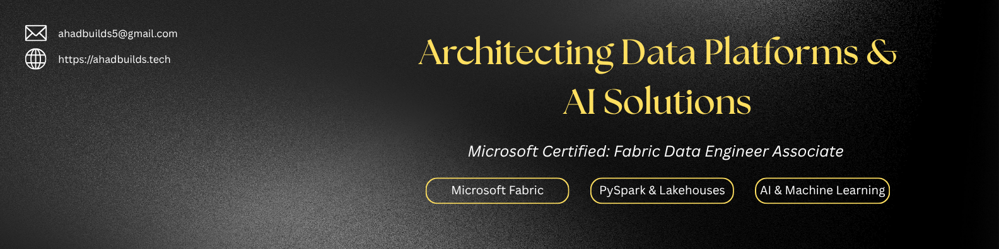

 

# Abdul Ahad

### Data Engineer & AI/ML Developer

**Microsoft Certified: Fabric Data Engineer Associate**

Building data platforms, intelligent applications, and machine learning solutions that turn data into actionable insights.

 

---

## About Me

I am a final-year Computer Science student at the **University of Engineering & Technology (UET), Lahore**, and a **Microsoft Certified: Fabric Data Engineer Associate**.

My focus lies at the intersection of **Data Engineering, Modern Data Platforms, Artificial Intelligence, Machine Learning, and Data Science**.

I build end-to-end solutions across the data and AI lifecycle, including:

- Data ingestion and transformation
- ETL / ELT pipelines
- Lakehouse-based data platforms
- Exploratory Data Analysis and feature engineering
- Machine learning and predictive modeling
- REST API development
- Business intelligence and interactive dashboards
- AI-powered applications

I am particularly interested in connecting **modern data engineering with AI/ML** to build practical, scalable, and data-driven software systems.

---

## Core Focus

| Data Engineering | AI & Machine Learning | Analytics & BI |
| :---: | :---: | :---: |
| Microsoft Fabric | Machine Learning | Power BI |
| PySpark | TensorFlow | Data Analysis |
| Lakehouses | Scikit-learn | Data Visualization |
| Data Pipelines | Predictive Modeling | Business Intelligence |
| ETL / ELT | Feature Engineering | Statistical Analysis |

---

## Featured Projects

### 🔹 SMARTMINER

**AI-Powered Data Mining & Predictive Analytics Platform**

An end-to-end platform combining data preprocessing, exploratory analysis, PCA, clustering, association rule mining, machine learning, deep learning, and interactive dashboards.

**Tech:** Python • React • FastAPI • Scikit-learn • TensorFlow • Pandas

[View Repository →](https://github.com/ahadbuilds/smartminer-ai)

---

### 🔹 CardioPulse AI

**Clinical Risk Prediction & Analytics System**

Machine learning-based heart disease prediction system incorporating exploratory data analysis, feature engineering, predictive modeling, and interactive analytics.

**Tech:** Python • Pandas • Scikit-learn • Matplotlib • Power BI

[View Repository →](https://github.com/ahadbuilds/CardioPulse-AI)

---

### 🔹 Air Pollution Detection System

**Environmental Data Analytics & Prediction**

A data-driven environmental analytics system for exploring global air-quality datasets, identifying pollution patterns, and generating analytical insights.

**Tech:** Python • Pandas • Scikit-learn • Data Visualization

[View Repository →](https://github.com/ahadbuilds/Air_Pollution_Detection_System)

---

### 🔹 Blockchain Prescription Verification

**Blockchain-Based Healthcare Application**

A blockchain-based system designed to provide secure and tamper-resistant prescription verification using decentralized technologies.

**Tech:** Blockchain • Solidity • Web Development

[View Repository →](https://github.com/ahadbuilds/Blockchain_Based_Prescription_Verification_System)

---

### 🔹 ATHLEIMAX

**Commercial Sportswear Manufacturer Website**

A production business website featuring responsive design, product categorization, SEO optimization, and a modern user experience.

**Tech:** HTML • CSS • JavaScript

[Live Website →](https://athleimax.works)

---

## Technical Stack

### Data Engineering & Cloud

  
  
  
  

### Artificial Intelligence & Machine Learning

  
  
  
  

### Data Science & Analytics

  
  
  
  
  

### Application Development

  
  
  
  
  

### Tools

  
  
  
  

---

## Certifications

- **Microsoft Certified: Fabric Data Engineer Associate** — Microsoft, 2026
- **Google Advanced Data Analytics** — Google / Coursera, 2025
- **Google Business Intelligence** — Google / Coursera, 2025
- **Generative AI Application Developer** — Pak Angels / ULEFUSA, 2025

---

## Current Focus

- Modern Data Engineering & Lakehouse Architecture
- Microsoft Fabric & PySpark
- Machine Learning & Predictive Analytics
- AI Application Development
- Data Analytics & Business Intelligence

---

## Education

**Bachelor of Science in Computer Science**  
University of Engineering & Technology (UET), Lahore  
Expected Graduation: **2027**

---

## Let's Connect

I am currently open to **Data Engineering, AI/ML, and Data Science internships and junior opportunities**.

  

📧 **ahad38390@gmail.com**

